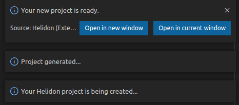

# Helidon support for Visual Studio Code

This extension helps users to generate their first Helidon project, develop and run it.

The [Java Extension Pack](https://marketplace.visualstudio.com/items?itemName=vscjava.vscode-java-pack) extension is optional 
but recommended for the installation in Visual Studio Code to support Java projects. 

## Requirements

* Maven 3.8.2 or newer is required to be installed in your system.
* Java 17 or newer is required to be installed in your system.

## Features

The Helidon extension provides:

* Helidon project creation wizard
* Start/stop Developer Loop (as you make source code changes the project will automatically recompile and restart your
  application)
* auto completion for configuration properties files (application.yaml, microprofile-config.properties, etc.)

## How to open the start page for the extension

1. Open Command Palette using `View -> Command Pallette...` from the top menu bar or by shortcut for this command for your Operating System
   (for Windows and Linux - `Ctrl+Shift+A`, for Mac - `Cmd+Shift+P`).
2. Start typing `Helidon` :

3. Choose `Helidon: Getting Started`.

## How to generate Helidon Project

1. Open Command Palette.
2. Start typing `Helidon` :

3. Choose `Helidon: Generate a New Helidon Project`.
4. Choose Helidon version :

5. Follow generator till the end.
6. You will receive messages during the process, and a request where do you want to open the project:

7. Your new project is generated

## How to start Helidon Dev Loop

1. Open Command Palette
2. Start typing `Helidon`
3. Choose `Helidon: Start Helidon Dev Loop`
4. If a workspace contains only one Helidon project, `Helidon Dev Loop` starts automatically. If the workspace contains more than one
   Helidon project, you will be asked to choose a directory to start `Helidon Dev Loop`.

5. You will find the server logs in the bottom panel in the tab `OUTPUT`. You can select a server to show the logs
   choosing a project directory in the drop-down list.

## How to stop Helidon Dev Loop

1. Open Command Palette
2. Start typing `Helidon`
3. Choose `Helidon: Stop Helidon Dev Loop`
4. If the workspace contains only one running Helidon project, `Helidon Dev Loop` stops automatically. If the workspace contains more
   than one running Helidon project, you will be asked to choose a directory to stop `Helidon Dev Loop`.

## Configuration of the extension

Helidon VSCode extension has three options that can be configured in the settings of the extension :
* Helidon: Show Start Page (`helidon.showStartPage`) :
  
  If start page should be displayed on the extension startup. 
  
  Default value - true.
* Helidon: Maven Home Dir (`helidon.mavenHomeDir`) :
  
  Path to the directory where Apache Maven is installed that will be used by the plugin.
  
  Default value - empty string (default Maven version for your Operating System will be used).
* Helidon: Java Home Dir (`helidon.javaHomeDir`) :
  
  Path to the JAVA_HOME directory of the installed JDK that will be used by the plugin.
  
  Default value - empty string (default Java version for your Operating System will be used).

## How to test

1. Clone the project [helidon-build-tools](https://github.com/oracle/helidon-build-tools)
2. You will need to build a module `ide-support` using `Maven`. This module contains backend and frontend parts of the VSCode extension,
 its dependencies and a maven plugin that is used by `Helidon Language Server`. 
3. Open the module `helidon-vscode-extension` in `VS Code`.
4. Run it

## Helidon Documentation

Helidon provides detailed documentation and guides for its components.

[Documentation](https://helidon.io/docs/latest)
[Guides](https://helidon.io/docs/latest/#/guides/01_overview)

## Do you have a problem or a question?

Let us know if you need help with Helidon on our Slack channel or report an issue on our issue tracker.

[Github issues](https://github.com/oracle/helidon-build-tools/issues)
[Slack channel](https://join.slack.com/t/helidon/shared_invite/enQtNDM1NjU3MjkyNDg2LWNiNGIzOGFhZDdjNzAyM2Y2MzlmMDI4NWY4YjE1OWQ2OTdkYTZkN2FlNDcxNmUyZmZmMTZhZmZhNWI2ZTI1NGI)
