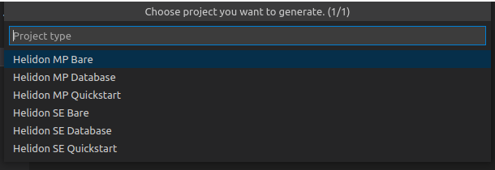

# Helidon support for Visual Studio Code

This extension helps users to generate their first Helidon project, develop and run it.

## Requirements

* Maven 3.5.3+ is required to be installed on your system.
* Helidon CLI is required to be installed on your system if you want to use continuous compilation and application
  restart.
*

The [Language Support for Eclipse MicroProfile](https://marketplace.visualstudio.com/items?itemName=redhat.vscode-microprofile)
extension is required to be installed in Visual Studio Code.

* The [Language Support for Java(TM) by Red Hat](https://marketplace.visualstudio.com/items?itemName=redhat.java)
  extension is required to be installed in Visual Studio Code.
* The [Java Extension Pack](https://marketplace.visualstudio.com/items?itemName=vscjava.vscode-java-pack) extension is
  optional but recommended.

## Features

The Helidon extension provides:

* Helidon project creation wizard
* Start/stop helidon dev (as you make source code changes the project will automatically recompile and restart your
  application)
* autocomplition for the application.properties files

## How to open the start page for the extension

1. Open Command Palette by shortcut you are using (default: Ctrl+Shift+P).
2. Start typing 'Helidon':

3. Choose 'Helidon: Start page'.

## How to generate Helidon Project

1. Open Command Palette by shortcut you are using (default: Ctrl+Shift+P).
2. Start typing 'Helidon' :

3. Choose 'Helidon: Generate a Helidon project'.
4. Choose type of the Helidon project :

5. Follow generator till the end.
6. You will receive messages during the process and a request where do you want to open the project:

7. Your new project is generated

## How to start helidon dev

1. Open Command Palette by shortcut you are using (default: Ctrl+Shift+P)
2. Start typing 'Helidon'
3. Choose 'Helidon: Start helidon dev'
4. If workspace contains only one helidon project, helidon dev starts automatically. If workspace contains more than one
   helidon project, you will be asked to choose a directory to start helidon dev.

5. You will find the server logs in the bottom panel in the output tab. You can select a server to show the logs
   choosing project directory in the drop-down list.

## How to stop helidon dev

1. Open Command Palette by shortcut you are using (default: Ctrl+Shift+P)
2. Start typing 'Helidon'
3. Choose 'Helidon: Stop helidon dev'
4. If workspace contains only one running helidon project, helidon dev stops automatically. If workspace contains more
   than one running helidon project, you will be asked to choose a directory to stop helidon dev.

## How to test

1. Clone the project
2. Run the following command in your newly cloned project folder
    * npm install
2. Open it in VS Code
3. Run it
4. You will need a backend part of the project Lsp4helidon
   from [helidon-build-tools](https://github.com/oracle/helidon-build-tools)
5. To build the backend part of the project run `npm run build`. This command runs scripts from package.json.

## Helidon Documentation

Helidon provides detailed documentation and guides for its components.

[Documentation](https://helidon.io/docs/latest)
[Guides](https://helidon.io/docs/latest/#/guides/01_overview)

## Do you have a problem or a question?

Let us know if you need help with Helidon on our Slack channel or report an issue on our issue tracker.

[Github issues](https://github.com/oracle/helidon-build-tools/issues)
[Slack channel](https://join.slack.com/t/helidon/shared_invite/enQtNDM1NjU3MjkyNDg2LWNiNGIzOGFhZDdjNzAyM2Y2MzlmMDI4NWY4YjE1OWQ2OTdkYTZkN2FlNDcxNmUyZmZmMTZhZmZhNWI2ZTI1NGI)
